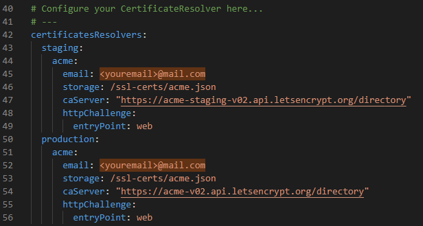
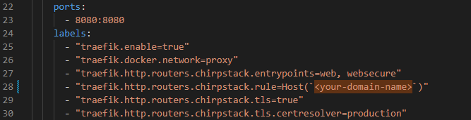

# Chirpstack-v4-LRFHSS Docker

This repository contains a skeleton to setup the [ChirpStack](https://www.chirpstack.io)
open-source LoRaWAN Network Server (v4) using [Docker Compose](https://docs.docker.com/compose/).

**Note:** This setup won't support LR-FHSS packets by defaults. Further modifications required!

**Note:** Multi-region supported by different ports on this server. Connect your gateway to the expected region according to the following table.

| **Region** | **Port** |
|:----------:|:--------:|
|    [eu868](https://github.com/chirpstack/chirpstack/blob/master/chirpstack/configuration/region_eu868.toml)   |   1700   |
|   [us915_0](https://github.com/chirpstack/chirpstack/blob/master/chirpstack/configuration/region_us915_0.toml)  |   1701   |
|   [us915_1](https://github.com/chirpstack/chirpstack/blob/master/chirpstack/configuration/region_us915_1.toml)  |   1702   |
|   [as923_2](https://github.com/chirpstack/chirpstack/blob/master/chirpstack/configuration/region_as923_2.toml)  |   1703   |
|    [kr920](https://github.com/chirpstack/chirpstack/blob/master/chirpstack/configuration/region_kr920.toml)   |   1704   |

## Installation

### Requirements


  - Linux machine/VPS *(I tested on **Ubuntu 20.04 LTS**)*
  - Git: [DigitalOcean - How To Install Git on Ubuntu 20.04](https://www.digitalocean.com/community/tutorials/how-to-install-git-on-ubuntu-20-04)
  - Docker & Docker-compose: [DigitalOcean - How To Install and Use Docker on Ubuntu 20.04](https://www.digitalocean.com/community/tutorials/how-to-install-and-use-docker-on-ubuntu-20-04)
  - A public domain for SSL
  - Firewall ports allow: 1700-1704 (Gateway Bridge Port), 80 (HTTP), 433 (HTTPs), 1883 (MQTT)

### Setup

1. Clone this reposistory

```
cd ~
git clone https://github.com/nguyenmanhthao996tn/Chirpstack-v4-LRFHSS.git
```

2. Setup Docker network

```
docker network create proxy
docker network create chirpstack-internal
```

3. Modify Traefik configuration file: Add your email address for Let's Encrypt SSL service in ```traefik.yml``` file.

```
vim ~/Chirpstack-v4-LRFHSS/docs/traefik/traefik.yml
```



4. Deploy Traefik docker container

```
cd ~/Chirpstack-v4-LRFHSS/docs/traefik/
docker-compose up -d
```

5. Modify Chirpstack docker configuration file: Add your public domain that point to your server to ```docker-compose.yml``` file.

```
vim ~/Chirpstack-v4-LRFHSS/docker-compose.yml
```



6. Deploy Chirpstack docker container

```
cd ~/Chirpstack-v4-LRFHSS/
docker-compose up -d
```

7. You should be good to go! Check your Chirpstack Webserver with your domain name. *HTTPs may take a few minutes.*

## LR-FHSS

At this point, the setup of Chirpstack v4 in general or Chirpstack v4 docker image (in this reposistory) *MAY* not fully support LR-FHSS packets/devices/gateways. Refer to my [Notes for LR-FHSS Support](./README-LR_FHSS.md) for more information!

This setup supports EU868 LR-FHSS Packet as following tables:

| **Frequency** | **Supported Data Rate(s)** |
|:-------------:|:----------------------:|
|   867.2 MHz   |         8 - 11         |
|   867.4 MHz   |         8 - 11         |
|   867.6 MHz   |         8 - 11         |
|   867.8 MHz   |         8 - 11         |
|   868.0 MHz   |         8 - 11         |
|   868.2 MHz   |         8 - 11         |
|   868.4 MHz   |         10 - 11        |

| **Data Rate** | **Coding Rate** | **OCW** |
|:------------:|:---------------:|:-------:|
|       8      |       2/6       |  137000 |
|       9      |       4/6       |  137000 |
|      10      |       2/6       |  336000 |
|      11      |       4/6       |  336000 |

## To-do
  - [x] Add [Traefik](https://github.com/traefik/traefik) to Docker-compose file for HTTPS support on web interface
  - [x] Write the document of modifications for supporting LR-FHSS

---

## Directory layout

* `docker-compose.yml`: the docker-compose file containing the services
* `configuration/chirpstack`: directory containing the ChirpStack configuration files
* `configuration/chirpstack-gateway-bridge`: directory containing the ChirpStack Gateway Bridge configuration
* `configuration/mosquitto`: directory containing the Mosquitto (MQTT broker) configuration
* `configuration/postgresql/initdb/`: directory containing PostgreSQL initialization scripts

## Configuration

This setup is pre-configured for all regions. You can either connect a ChirpStack Gateway Bridge
instance (v3.14.0+) to the MQTT broker (port 1883) or connect a Semtech UDP Packet Forwarder.
Please note that:

* You must prefix the MQTT topic with the region
  Please see the region configuration files in the `configuration/chirpstack` for a list
  of topic prefixes (e.g. eu868, us915_0, au915, as923_2, ...).
* The protobuf marshaler is configured.

This setup also comes with a ChirpStack Gateway Bridge instance which is configured to the
eu868 topic prefix. You can connect your UDP packet-forwarder based gateway to port 1700.

# Data persistence

PostgreSQL and Redis data is persisted in Docker volumes, see the `docker-compose.yml`
`volumes` definition.

## Requirements

Before using this `docker-compose.yml` file, make sure you have [Docker](https://www.docker.com/community-edition)
installed.

## Importing device repository

To import the [lorawan-devices](https://github.com/TheThingsNetwork/lorawan-devices)
repository (optional step), run the following command:

```bash
make import-lorawan-devices
```

This will clone the `lorawan-devices` repository and execute the import command of ChirpStack.
Please note that for this step you need to have the `make` command installed.

**Note:** an older snapshot of the `lorawan-devices` repository is cloned as the
latest revision no longer contains a `LICENSE` file.

## Usage

To start the ChirpStack simply run:

```bash
$ docker-compose up -d
```

After all the components have been initialized and started, you should be able
to open http://localhost:8080/ in your browser.

##

The example includes the [ChirpStack REST API](https://github.com/chirpstack/chirpstack-rest-api).
You should be able to access the UI by opening http://localhost:8090 in your browser.

**Note:** It is recommended to use the [gRPC](https://www.chirpstack.io/docs/chirpstack/api/grpc.html)
interface over the [REST](https://www.chirpstack.io/docs/chirpstack/api/rest.html) interface.

---

##### <i>Maintained by M.T.</i>
